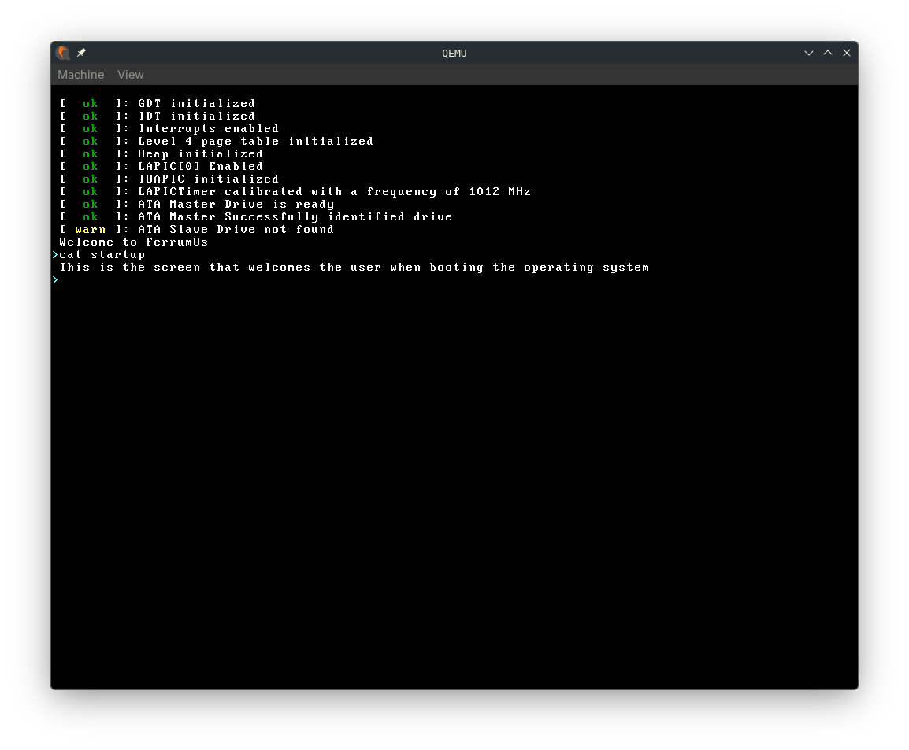
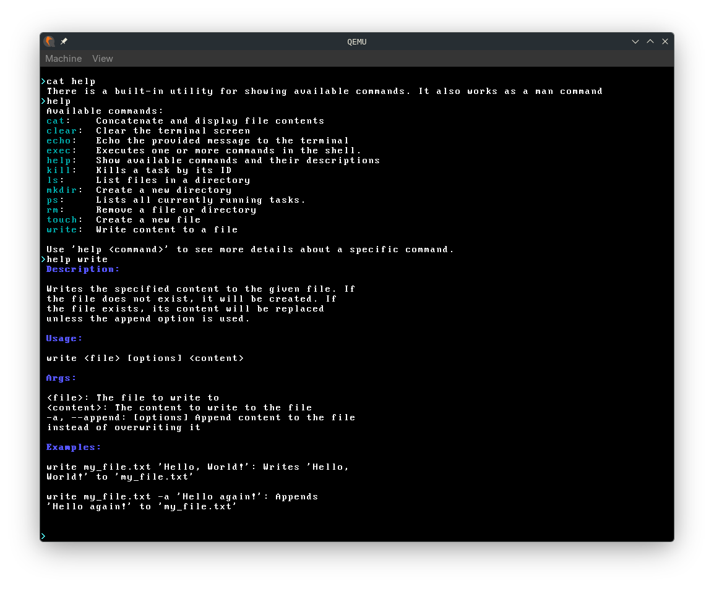
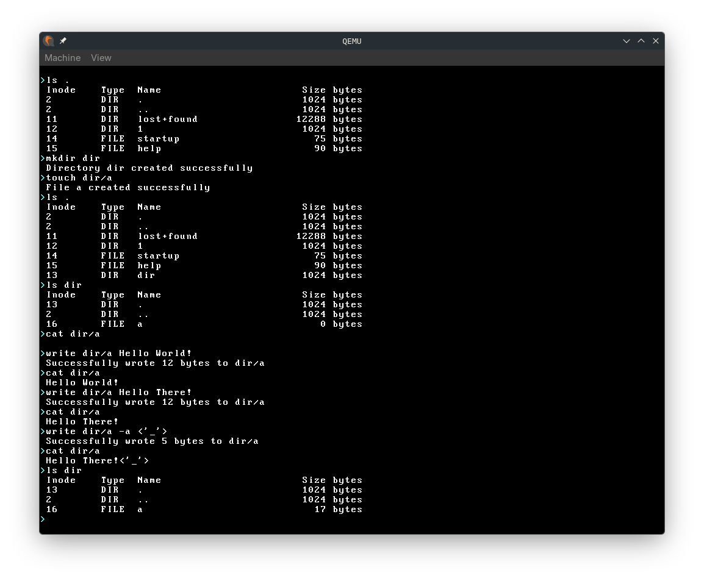
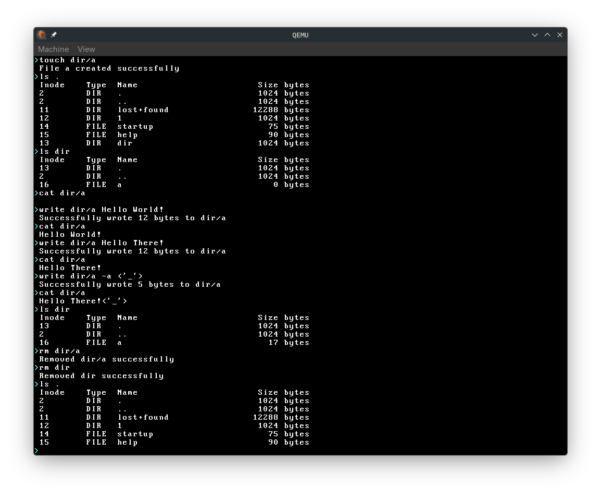

# FerrumOS

A hobby x86-64 operating system written in Rust, implementing core OS concepts from scratch.

## Overview

FerrumOS is a from-scratch operating system kernel developed as part of my bachelor's thesis exploring operating system internals, low-level systems programming, and the Rust programming language's safety guarantees in kernel development. This project demonstrates practical implementation of fundamental OS components including memory management, interrupt handling, multitasking, timer subsystems, and file system support.

> "Any sufficiently advanced technology is indistinguishable from magic" — Arthur C. Clarke

This thesis and implementation aim to demystify the "magic" behind operating systems by providing a practical, well-documented reference implementation that bridges the gap between hardware and software.

## Features

* **4-Level Paging**: `./kernel/src/memory` - Implements 4-Level paging for virtual memory management.
* **Heap Allocation**: `./kernel/src/allocator` - Contains implementations for various allocation algorithms, including: *Bump*, *Linked List*, and *Fixed Size Blocks*.
* **Interrupts**: `./kernel/src/interrupts` - Uses an external crate to set up an Interrupt Descriptor Table (IDT) and provides handlers for multiple interrupts. It supports both *LAPIC* and *IO-APIC*.
* **Drivers**: `./kernel/src/drivers`
    * **ACPI** and **APIC** parsers for hardware discovery and management.
    * **VGA** and **Linear Framebuffer** for graphics support.
    * **Text Writer** to enable text output on the screen.
        * **PSF Font** parser for custom fonts.
        * **ANSI Parser** that currently supports colored text and cursor manipulation.
    * **ATA** driver for communication with persistent storage devices.
* **Async/Await**: `./kernel/src/task` - Implements a simple executor and a keyboard task to enable **cooperative multitasking**.
* **Timers**: `./kernel/src/timers` - Implements different timers for calibration and general use, supporting **PIT**, **HPET**, and **APIC** timers.
* **File System**: `./kernel/src/fs` - Implements an **ext2fs** file system that supports reading and writing files, creating and removing files and directories, and listing directory contents.
* **Shell**: `./kernel/src/shell` - A minimal shell with ANSI codes support built for feature testing and basic interaction.

## Gallery
In this section is presented a gallery of images of the working operating system.









## Documentation

The complete thesis documentation is available in the repository (`./Thesis.pdf`), covering:

- Memory Management
- Interrupt Handling
- Multitasking
- Timer Subsystems
- File Systems
- Graphics Foundations

## Prerequisites

- **Rust** (nightly toolchain recommended)
- **xorriso**
- **QEMU**
- **NASM** assembler
- **GNU Make**

## Installation

### Rust

For installing the Rust programming language head to `https://rust-lang.org/tools/install/` for instructions.

Install the Rust nightly toolchain:

```bash
rustup toolchain install nightly
```

Enable the nightly toolchain for this project. Note that the method used bellow is preferred to setting the nightly toolchain as default for all projects, but would work either way.

```bash
rustup override set nightly
```

### QEMU

For this project only the folowing modules are required:
- `qemu-system-x86`
- `qemu-ui-gtk`

And can be installed through various package managers depending on your distribution. Using the `pacman` package manager you can install them by running:

```bash
pacman -S qemu-system-x86 qemu-ui-gtk
```

Or by heading to `https://www.qemu.org/download/` and folowing their instructions.

### xorriso

It is required as a dependency for the makefiles, similary to **QEMU** it can be aquired via your package manager:

```bash
pacman -S xorriso
```

## Using the MakeFile

The project is compilated using the `GNUmakefile` in the root of the project. 

- `make limine` and `make ovmf` install limine and ovmf dependencies.
- `make check`, `make doc`, `make clippy` and `make kernel` run different cargo options: `check`, `doc`, `clippy` and `build` respectively.
- `make run` installs the dependencies, creates the virtual disk with an ext2 filesystem, builds the image and starts qemu. Note that if the argument `MODE=d` is passed to this command, the operating system will be compiled in debug mode instead of release.

## Throubleshooting

If you get this kind of errors when running `make run`

```
cp: cannot stat 'limine/limine.sys': No such file or directory
cp: cannot stat 'limine/limine-cd.bin': No such file or directory
cp: cannot stat 'limine/limine-cd-efi.bin': No such file or directory
```

It might be helpfull to delete the limine folder entirely and rerun `make run`